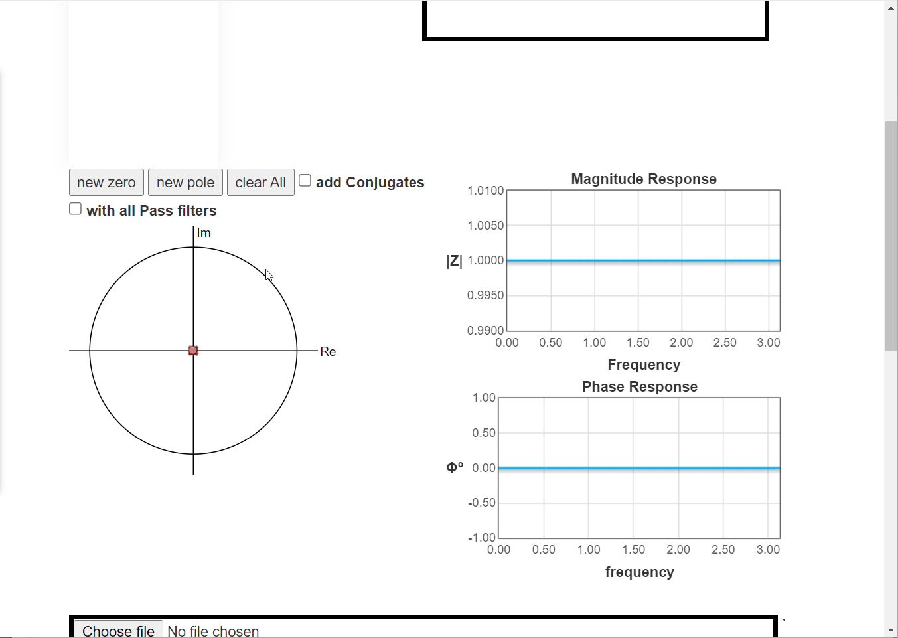
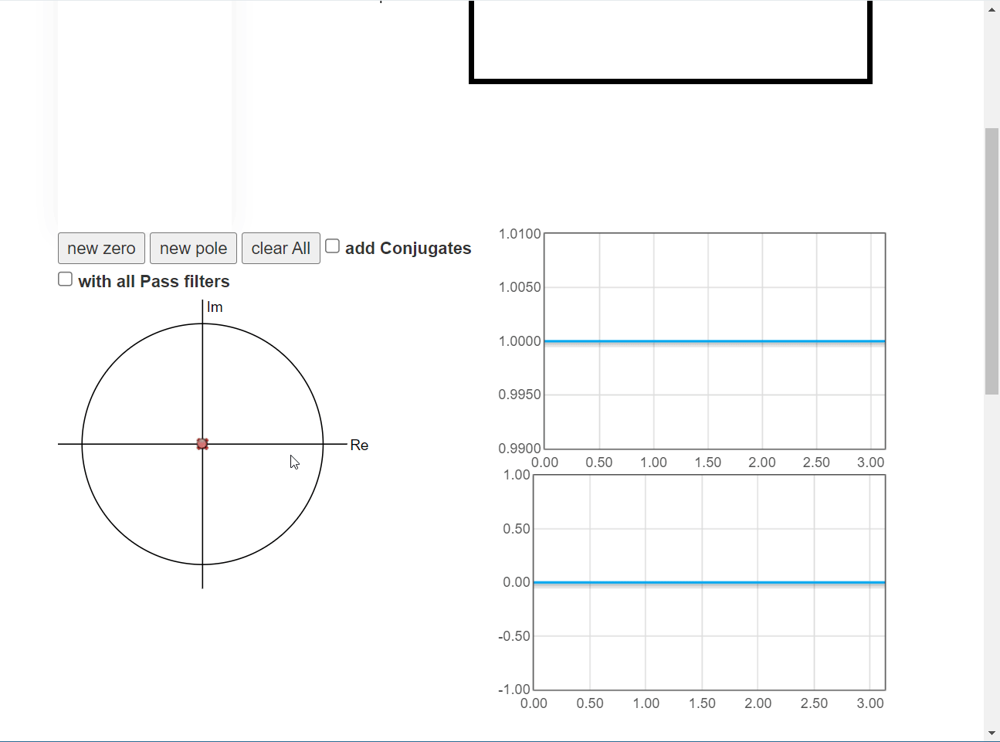
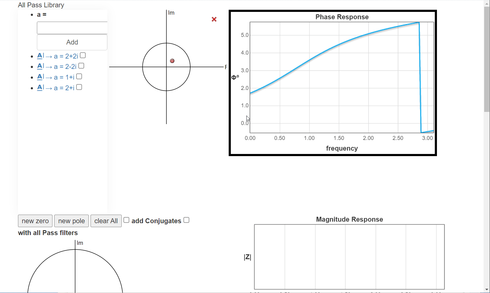
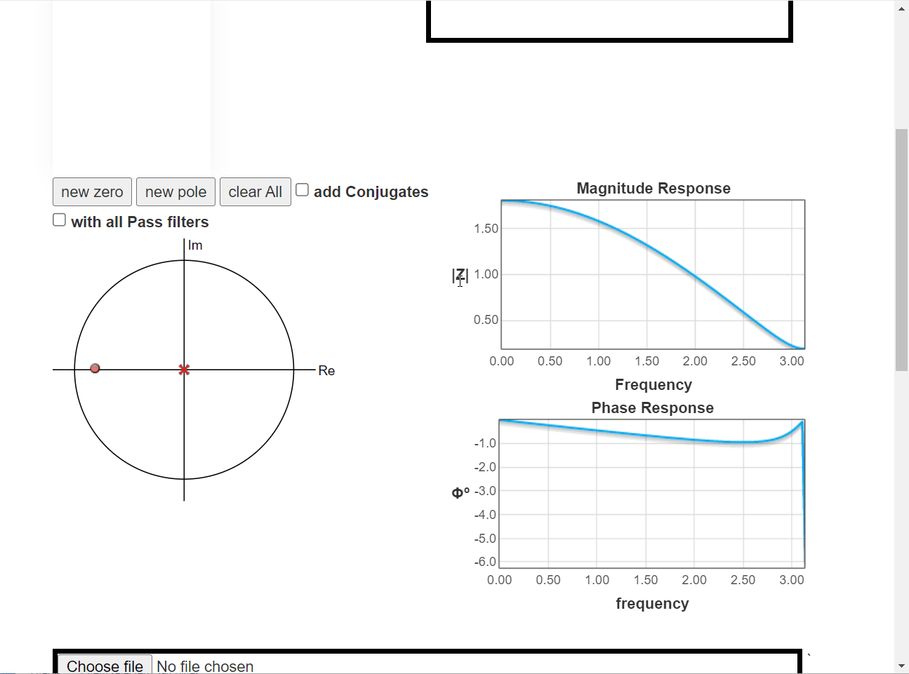
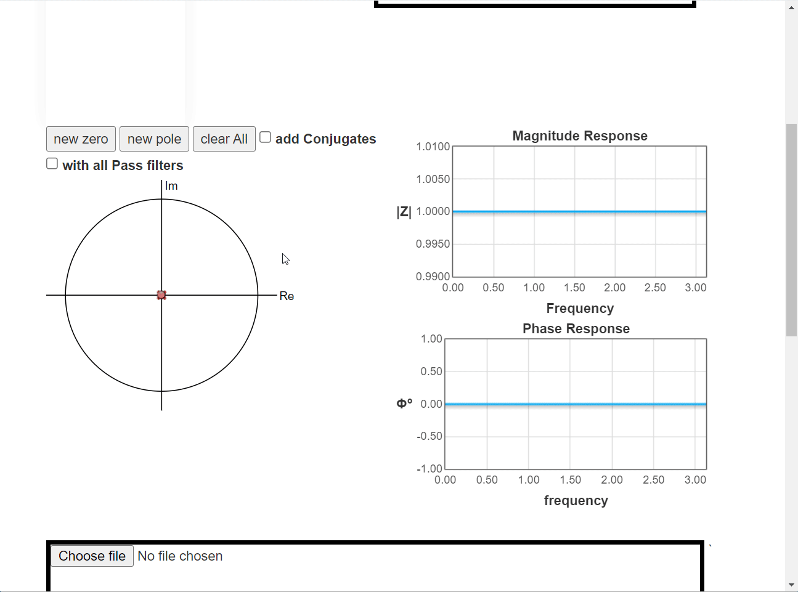

# Real Time Filter(Digital Filter)
- [Description](#Description)
- [Z plane](#Z_plane)
    - [Features](#features)
    - [Demos](#Demos)
      - [Low Pass Filter](#Low_Pass_Filter)
      - [Notch Filter](#Notch_Filter)
- [ALL Pass Filiters ibrary](#ALL_Pass_Filiters_Library)
   - [Pros](#Pros)
   - [Demos](#Demos)
     - [All Pass Library](#ALL_Pass_Library)
     - [All Pass Effect](#ALL_Pass_Effect)

- [Real Time Filtering Process](#Real_Time_Filtering_Process)
   - [Demos](#Demos)
- [Run-App](#Run-App)  
------
## Description
- This is a website that helps users to design a custom digital filter via zeros-poles placement on the z-plane. The website has the following feature:
-----
## Z_plane
### features
- A plot for the z-plane with the unit circle, where the user can place different zeros and poles. The user can also
make the following modifications:
   - Modify the placed zeros/poles by dragging them.
   - Click on a zero or pole and delete it.
   - Clear all zeros or clear all poles or clear all.
   - Has the option to add conjugates or not for the complex elements.
- A plot that shows the corresponding frequency response for the placed elements: One graph for the magnitude
response and another graph for the phase response.

-----
### Demos

 #### Low_Pass_Filter
 
 #### Notch_Filter
  


------
## ALL_Pass_Filiters_Library
Correct for the phase by adding some All-Pass filters to be linear. The user can pick the suitable all-pass through a library available in The website ,the websit has:
### Pros
- A library of all-pass filter that the user can visualize (its zero-pole combination as well as its phase response), then pick one or more to add to the original design filter.
- A custom-built all-pass: if the user cannot find a good all-pass in the provided library, then s/he build his own.
- The user can enable/disable the added all-pass elements via a drop-menu or checkboxes group.


------ 
### Demos
#### ALL_Pass_Library

#### ALL_Pass_Effect



------
### Real_Time_Filtering_Process


---
### Demos


-----


## Run-App
**_Run the application_**
```sh
python application.py
```

